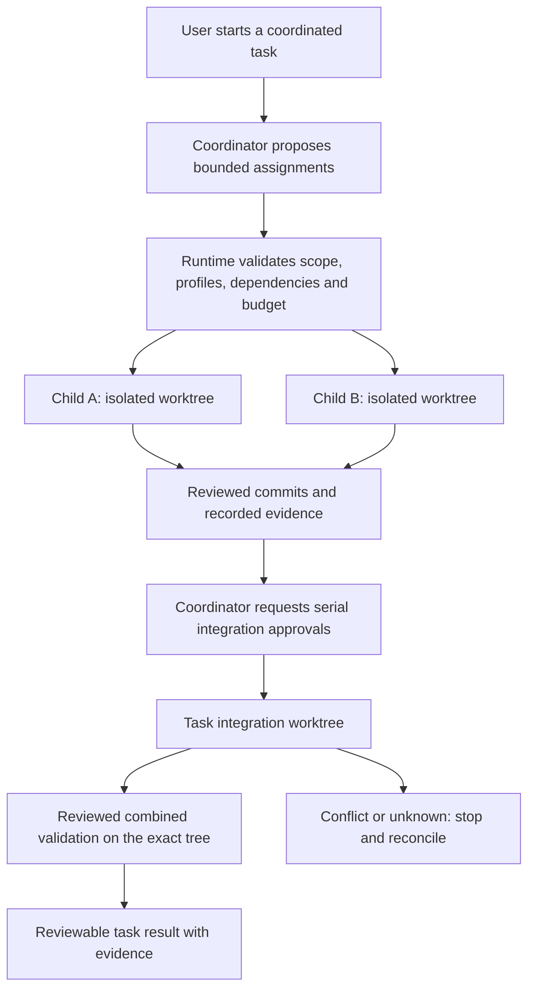

# Coordinator and child orchestration — implementation plan

**Status: approved by Rudy and implemented locally on branch `agent/claude/coordinator-orchestration`.** Prepared 17 September 2026 against `f75d1edde5b467049aed4edb51a768520305958c` (0.2.0). Actual delivered behavior, validation evidence, review findings and remaining gates are recorded in [implementation status](implementation-status.md); the design text below is retained as the approved requirement, not as evidence.

The [product baseline](foundry-agent-workspace-plan.html#safety) and [current implementation status](implementation-status.md) remain authoritative for scope and existing evidence. The baseline's phase 03 requires coordinator-led delegation, isolated children, serial integration, aggregate budgets, and combined-result validation. Parallel independent chats do not meet that requirement.

## Decision requested

Approve implementation of the five increments below, including an additive SQLite v2 migration **implemented and tested only against isolated fixtures during development**, narrow reviewed local Git commit/integration actions, and the coordinator UI. The default is one coordinator, one level of children, two admitted nonterminal child runs per task, eight total assignment revisions, and three shared execution slots across the application.

Approval would authorize this bounded implementation and its local fixture validation. It would not authorize upgrading existing user application data during development, live paid model probes, publication, source/main-branch integration, worktree deletion, or bypassing runtime action approvals. An existing application database would receive a separately confirmed, backed-up upgrade through the application before orchestration is used. No new production dependency is proposed.

MCP, compaction, remembered approvals, general-purpose Git UI, automatic conflict resolution, browser tools, and signed/clean-install release qualification remain later work. Existing file-creation, worktree-size, and Windows-only command PATH limitations remain visible; this increment does not silently weaken them.

## Outcome and non-negotiable acceptance

In a temporary repository, a coordinator assigns two independent changes to children. Each child gets its own branch/worktree and bounded scope, produces a reviewed commit and runtime-backed validation evidence, and submits a structured result. The coordinator selects those results, requests reviewed integration, cherry-picks them serially into the task worktree, and runs the combined checks. The app shows the resulting diff, provenance, budgets, and evidence after restart.

The source checkout's files, index, HEAD, existing user branches, and remote-tracking refs remain unchanged, including any pre-existing uncommitted work. App-owned `codex/` branches and linked-worktree metadata are intentional shared Git mutations. Nothing is pushed or merged into main.

## Recommended design

### 1. Explicit coordinated tasks, with legacy compatibility

Add a persisted `coordinated` task mode. Existing Chat/Coding tasks keep their current behavior and data; do not infer coordination from Coding mode, convert old conversations, or backfill them into coordinator runs. New children have their own conversation/task identity and worktree but appear under their parent in the UI, not as unrelated top-level tasks.

Keep Electron main as credential/sender-validation/supervision owner; keep the renderer presentation-only. The runtime remains the only database writer, scheduler, repository execution authority, and policy decision maker. Providers remain wire adapters. Product agents use explicitly selected, verified Foundry profiles; this development team's Terra routing is not a product model restriction.

### 2. Durable contracts and an additive migration

Use explicit indexed records for orchestration instead of stretching the existing generic `intents` JSON into a scheduler. Proposed records:

| Record | Minimum durable facts and constraints |
| --- | --- |
| Agent run | Run/task/root/parent IDs, role, lifecycle state plus wait/block reason, generation, cancellation request, exact worktree/branch identity; one coordinator per coordinated root; child depth exactly one. |
| Assignment | Immutable ID/revision, objective, acceptance criteria, normalized allowed read/write paths and operations, selected profile/capability fingerprint, allocation cap, dependencies, recorded base commit/tree once eligible. Retries create new revisions, never overwrite prior evidence. |
| Dependency edge | Same-root predecessor and successor IDs; reject self-links, unknown nodes and cycles. Code dependencies require successful integration and validation, not just a child text report. |
| Budget account/entry | Root cap, coordinator allocation, child allocation holds/releases, uniquely identified request reservations and settlements, retained unknown usage. Allocation is separate from consumption. |
| Child result | Immutable result revision with assignment/base/commit/tree, changed paths, runtime-issued validation evidence IDs, redacted summary and unresolved issues. Model prose is a claim, not proof. |
| Wait/integration operation | Idempotency key, caller run/generation and native pending-call ID, selected immutable results, expected Git before-state, approval binding, lifecycle and observed outcome. |
| Validation evidence | Executed approved command, profile-free execution identity, worktree/HEAD/tree, tracked-dirty/untracked-input fingerprint where relevant, exit and cleanup evidence, output reference, timestamps. |

Implement a numbered v1→v2 migration with foreign keys, uniqueness constraints and recovery indexes; preserve existing tables and opaque provider state. Before any user-data upgrade, stop admission, finish/stop active work, use SQLite's supported backup mechanism, verify the backup opens and passes integrity checks, then apply the migration transactionally and set `user_version`. Do not copy a live WAL database as though the main `.db` file alone were complete. [SQLite backup guidance](https://www.sqlite.org/backup.html).

The current 0.2.0 binary rejects databases newer than v1. Rollback therefore means retaining the v2 database and opening a separately restored, verified v1 backup with the older binary; never downgrade in place or overwrite post-upgrade history. Test fresh creation, v1 compatibility, failed backup, interrupted migration, rollback preservation, and rejection of unsupported future versions.

### 3. Coordinator tools and a bounded scheduler

Add coordinator-only typed operations such as `delegate_assignments`, `await_children`, `integrate_result`, and `complete_task`. Children may submit a structured handoff but cannot delegate, integrate siblings, enlarge their scope, change their selected profile, or grant permissions. Reject a fabricated coordinator-only call at the runtime policy boundary even if the adapter already rejected it.

At task creation the user selects the coordinator profile, permitted child profiles, budget, concurrency bounds, and required final validation. A coordinator may create assignments within those limits; it cannot use repository text or its own output to extend them. Scope changes require a new visible assignment revision and invalidate obsolete approvals. Default child profile is the explicitly selected coordinator profile unless the user selects another verified profile. No deployment-name inference or silent fallback.

The scheduler admits at most two nonterminal child runs per root, counting every admitted run while queued, preparing, running or waiting. Additional assignments remain unprovisioned proposals: they count toward the eight-assignment bound but have no child worktree or allocation hold until atomic admission succeeds. Their requested budget is a cap, not reserved funds. All runnable coordinator/child model and command spans share the existing global three-slot limit; waiting consumes no execution slot but retains its child admission. Use fair admission across roots and profile-specific request limits. A rejected/revoked/failed/cancelled assignment still counts toward the revision bound, preventing unlimited retry/delegation loops.

Persist `await_children` against exact assignment IDs, result revisions when available, and the parent's native pending-call/generation. The coordinator can park without a slot. Once the bound children have safe terminal results, materialize one bounded, redacted tool result and resume the existing native continuation once. Never pass a child's raw reasoning or native provider context to the parent. An unknown child effect blocks delivery as success. Child final prose without a validated handoff is incomplete; coordinator final prose without the completion gates cannot mark the task done.

Rate-limit waiting is a scheduler state, not a held slot. Persist profile cooldown information, but do not automatically retry inference requests in this increment. A transport failure may follow accepted or billed inference: retain its conservative reservation and require explicit user continuation; never replay a partially completed model turn or tool mutation. An unavailable profile blocks its run without cancelling unrelated siblings using available profiles.

### 4. Aggregate budgets before concurrency

Budget admission and settlement must be one runtime transaction before every request. The parent display must not add child usage to a total that already includes it.

Track distinct quantities: charged/retained usage, in-flight request reservations, unused coordinator funds, unused child allocation holds, and unallocated funds. They must reconcile to the root cap; an allocation hold is not a token charge. Converting a hold into a request reservation, or settling that reservation, transfers the amount rather than counting it twice.

Recommended default: protect 20% of the root cap for coordinator/integration work before allocating children. This is a minimum protected allocation, not a hard 20% coordinator spending ceiling: the coordinator may use unallocated or returned funds, but may not silently borrow a live child's held allocation. Child allocation admission also subtracts already spent/reserved funds, so completed earlier children cannot make new allocations appear affordable twice. Configure the deterministic fixture with enough budget for conservative unknown-usage accounting.

Release only a proven unused allocation when a child reaches a safe terminal state. Missing usage and interrupted requests retain their full conservative request reservation. Record actual overages truthfully, block new admission and request attention rather than altering counters to fit the cap. Local admission limits are not a guarantee about provider billing. Warn at 80%; enforce both child and root limits. Any user increase/reallocation is explicit, versioned and recorded; no automatic budget expansion.

### 5. Worktrees, scope and reviewed child commits

Extend `RepositoryService` with exact-base child creation. Independent children start from the same frozen, clean integration HEAD. A dependent child is not provisioned until predecessor results have been integrated and their required combined validation has passed; it starts from that resulting HEAD. Keep paths and refs generated by the runtime under the existing app-owned roots and `codex/` namespace.

Normalize scope using segment-aware exact paths/prefixes and Windows case handling. Reject overlapping concurrent write scopes; overlapping/dependent changes must run serially from an updated base. Read scope may be broader than write scope only when declared. Enforce file-tool scope before access, recheck the complete changed-path set before accepting a commit, and recheck at integration. Include renames, deletions, untracked files, case-only changes, secret paths, symlinks, submodules and Git metadata in the denial tests.

Approved arbitrary PowerShell commands still run with the user's Windows privileges and can act beyond these scopes. State that limitation in the child approval UI; do not call the worktree a sandbox. Detect Git-visible violations afterwards and block their handoff/integration. Never interpret a successful command exit as proof of scope compliance.

Initially accept **one non-merge handoff commit per assignment**, whose sole parent is the recorded assignment base. The runtime performs a narrow `commit_child_handoff` operation after a one-shot approval. Bind the approval to the child/revision, expected HEAD, current index state, exact selected path set/content hashes and rendered patch, generated message and Git executable identity. Do not require the intended edits to be absent: the child is clean at creation and after committing; at commit preflight it contains exactly the approved changes and no unrelated index/worktree changes.

After approval, persist the mutation intent, stage only literal approved paths, verify the staged content against the approved snapshot, persist the resulting tree and commit before-state, then create and verify the commit. Never use `git add .`, absorb unrelated changes, or infer authority from a commit message. Crash gaps between staging, tree recording and commit are recovery cases, not reasons to retry blindly. No remembered or task-wide commit permission in this increment.

### 6. Serial coordinator integration and conflicts

Use the existing task worktree as the integration target. A second staging worktree would add lifecycle complexity without further protecting the source checkout. Reserve one integration operation at a time per root, serialize repository metadata operations where needed, and prevent coordinator file/command mutations from racing integration. Do not hold a model execution slot while waiting for approval or an integration lock.

For each selected child result, prepare a new one-shot approval bound to root/child/revision, handoff SHA/base/tree, current target HEAD/tree, changed paths, patch, Git identity, and operation ID. Require a clean target, the expected app-owned branch/worktree, valid ancestry and no pre-existing Git operation. Recheck immediately before execution; earlier integration invalidates later approvals prepared against an older target HEAD.

Before approval, persist a canonical source-effect manifest from the recorded assignment base to the handoff commit: exact paths, old/new file modes and full old/new blob IDs, with renames represented as delete/add. Compute SHA-256 over the stable manifest and bind it and the displayed patch to the operation. Use fixed Git diff options, disabling external diffs, text conversion and rename inference; do not derive the manifest from commit prose.

The coordinator's typed executor performs `git cherry-pick --no-edit -x <exact handoff SHA>` after durable intent. Use fixed arguments, pinned Git, no network, existing hook/filter protections, noninteractive signing/editor controls, and reject configured custom merge drivers. Disable rerere auto-resolution/update. On ordinary success, verify the new single-parent commit follows the expected target HEAD and its target-before→result effect manifest exactly equals the approved source-effect manifest. Also verify accepted scope, expected branch/worktree, clean index/worktree and absence of cherry-pick/sequencer markers. This strict rule is compatible with disjoint independent write scopes and dependent children based on the integrated HEAD; any unexpected same-file drift blocks acceptance. The runtime operation record plus actual trees/parents are authoritative; `-x` provenance text alone proves nothing. Git requires a clean tree and exposes explicit conflict/sequencer state for this operation. [Git cherry-pick reference](https://git-scm.com/docs/git-cherry-pick).

On conflict, preserve the worktree/index and record the pre-pick HEAD, selected SHA, `CHERRY_PICK_HEAD`, unresolved paths and index fingerprint. Block dependent work and expose the canonical path for external-editor resolution. Do not reset, clean, abort, drop commits, or delete worktrees automatically.

After the user resolves files, read-only reconciliation must find the same operation/HEAD/`CHERRY_PICK_HEAD` and no unresolved index entries. A fresh approval binds the **new resolved index tree**, its effect manifest, reviewed diff and unchanged worktree inputs before typed `cherry-pick --continue`. The explicitly approved resolved tree replaces the original effect expectation for that continuation; require the resulting commit's tree/parent to match it exactly. Reject out-of-scope resolutions. Rerun validation on the final result. External abort/completion is reconciled from observed state; cancellation alone never authorizes discarding the conflict work.

An empty cherry-pick is a distinct blocked outcome, even when `CHERRY_PICK_HEAD` exists without unresolved entries. Do not offer `--continue`, auto-skip, or manufacture an empty commit. Preserve operation/worktree evidence for reviewed external recovery and read-only reconciliation. Classify an equivalent effect as already present only with exact recorded blob/mode/path proof; that does not clear sequencer state or by itself complete integration.

### 7. Cancellation, recovery and completion evidence

Persist lifecycle and operation state separately. Suggested run lifecycle: `queued → preparing → running ↔ waiting → terminal`, with typed reasons for dependencies, children, approval, profile quota, task budget, conflicts and reconciliation. Terminal outcomes distinguish succeeded, incomplete, failed and cancelled. `unknown` describes an unproven operation outcome and blocks affected progression; it is not a successful terminal run.

Child cancellation fences that child's generation, stops its model/command, revokes its pending approvals and retains evidence; siblings continue. Parent cancellation first durably fences the root and descendants, then aborts active work and removes queued admissions. Late child creation/results/approval responses cannot resurrect either run. Windows process cleanup must be proven independently from model cancellation.

Restart never silently resumes paid requests or mutation attempts. Reconstruct the tree, dependency queues, reservations, waits and events; revoke pending approvals; mark interrupted provider spans and unknown mutation outcomes truthfully. Explicit Resume first performs read-only reconciliation. It may schedule work proven never started or deliver already recorded child results; it cannot replay an interrupted provider span or an uncertain tool call. Continuing after an interrupted model turn requires an explicit user continuation and provider-valid failure results for unfinished calls.

Git reconciliation compares operation-specific expected refs, parents, trees, index/worktree state and operation markers. Recognize complete/no-effect only with sufficient evidence. Everything else stays blocked for inspection. Never treat empty output, an exited process, a matching message or a green child report as sufficient proof.

The coordinator must run the task's required combined checks through existing command approval policy on the exact integrated result. Bind evidence to HEAD/tree and relevant dirty/untracked/executable inputs; any later change invalidates it. Success requires every required assignment/dependency resolved, selected results integrated, combined validation passed, no pending approval/conflict/unknown effect, and required cleanup verified. Otherwise expose an incomplete/blocked task with its reason.

### 8. Desktop and protocol changes

Add bounded schemas/RPC for the coordinated task configuration, agent tree/detail, immutable assignments/results, cancel child/cancel root, explicit Resume, approval decisions, integration reconciliation, and evidence summaries. Reuse the private stdio/preload boundary; extend main's validated method allowlist rather than exposing generic IPC or shell access.

Reject existing `task.send` calls targeting child task IDs before provider or repository activity. Child objectives and inputs enter through immutable coordinator assignments; a user change requires a new visible assignment revision through a dedicated parent-targeted operation. Keep existing standalone Chat/Coding sends unchanged. Main validates schema, sender/frame and allowed method; runtime validates stateful parent/child ownership, generation and approval binding before any domain mutation.

Every approval additionally binds root task, target run/task, assignment revision, action ID/generation and fingerprint. Show the target child and scope prominently; parent/sibling approvals cannot substitute. The task page adds an agent tree and assignment, integration and evidence views, aggregate versus per-agent budget display, explicit wait reasons, scoped cancellation and recovery actions. Use bounded/paged summaries so child histories do not multiply the existing RPC frame limit. Render all model/repository/report text as untrusted text and retain secret screening.

Define shared, tested protocol/store limits: eight assignment revisions, two admitted child runs, eight child summaries per page, fifty events per page, 4 KiB UTF-8 summary/event text, 16 KiB child report text, and a 256 KiB serialized orchestration-response ceiling below the existing 1 MiB transport limit. Redact before truncating display text and show truncation explicitly; return fewer page entries with a cursor when the byte ceiling would be exceeded. Never truncate authoritative IDs, hashes, structured results, native continuation state or approval evidence: reject or separately page oversized content. Branch renderer behavior explicitly on `mode === 'coordinated'`; retain legacy absent-mode handling.

## Five implementation increments and review gates

| Increment | Main work and likely files | Exit evidence |
| --- | --- | --- |
| 1 — Contracts, migration and budget authority | Protocol schemas; additive store/migration APIs; immutable runs/assignments/results; budget reservation/settlement and recovery records. New focused runtime modules, retaining `Store` as the writer. | v1 compatibility/backup/migration failure tests; malformed relations/cycles; transactional allocation/reservation races; no double charging. Delegation remains disabled. |
| 2 — Child repository operations and policy | Exact-base worktrees, scope policy, reviewed child commits and operation-specific Git reconciliation; extend `repository.ts` through a focused Git-operation module and `ToolRuntime`. | Exact-base/source-preservation, scope/rename/secret, stale approval/index/HEAD, commit crash and no-replay tests. No broad Git tool. |
| 3 — Scheduler and native coordinator loop | Bounded scheduler, per-run lifecycle/generation, delegate/await/result tools, profile quota admission, child worktrees and budgets, isolated/cascading cancellation; `service.ts`, `agent-loop.ts`, shared slots. | Two real fixture child loops run; coordinator waits without a slot; nested delegation/replay rejected; queue fairness, immutable wait delivery and cancel races pass. |
| 4 — Integration, conflict recovery and completion | One-at-a-time reviewed cherry-picks, dependency bases, external resolution/continue, combined-validation records and completion guard. | Two child commits integrated and validated; stale target, conflict, interrupted integration and stale validation cannot pass; source checkout remains unchanged. |
| 5 — Desktop workflow and packaged acceptance | Agent tree/target approvals/budgets/recovery UI, deterministic coordinator fixture, docs, package smoke and cross-review fixes. | Exact Electron workflow, restart/cancel/conflict paths, all required checks and independent security/data-integrity review pass for the final source/build. |

Keep the coordinated mode unavailable to normal users until all five exits pass. Stop at a failed boundary rather than enabling a partial feature under a misleading label. Freeze shared schemas/store APIs before parallel file ownership; do not let multiple agents edit the same boundary simultaneously.

Implementation routing after approval: owner integrates contracts/store, design decisions and final validation. At most three Terra/medium children handle bounded scheduler/provider work, repository operations, and renderer/user-path tests; rotate independent reviews after each authored scope stabilizes. Reconfirm branch/coordination claims before edits. Use focused commits on the private task branch; no main integration/publication.

## Risk-based validation plan

| Priority | Fixture or failure | Required result |
| --- | --- | --- |
| P0 | Two independent children, distinct profiles in injected transports, separate commits, serial integration | Real temporary Git commits and real SQLite evidence; coordinator performs integration; combined tests execute and bind to final tree. |
| P0 | Concurrent allocations/requests, unknown usage, restart and duplicate settlements | Root/child caps hold transactionally; usage is counted once; held allocations cannot be spent by another run. |
| P0 | Provider transport failure after accepted inference or first response bytes | No automatic second request; retained reservation and explicit continuation requirement survive restart. |
| P0 | Forged parent/sibling/revision approval, nested delegation, malicious result text | No worktree/tool/commit/integration side effect; explicit error and retained audit event. |
| P0 | Every new mutation RPC: malformed/unsupported method or non-main-frame sender; valid-shape foreign run/revision/nonce | Main rejects invalid ingress without runtime/store activity; runtime rejects foreign bindings before domain effects, retaining only the appropriate denial audit. No assignment, approval, budget or worktree mutation. |
| P0 | Direct `task.send` to a child; third nonterminal child admission | Direct send has no provider/worktree effect; new input requires an assignment revision. Third assignment stays unprovisioned with no allocation hold until admission becomes available. |
| P0 | Crash before/after worktree creation, staging, child commit, cherry-pick, continue and evidence persistence | No duplicate child, commit or integration; precise no-effect/complete proof or visible unknown. |
| P0 | Child cancel versus parent cancel, including queued wait and late completion races | Only intended descendants stop; no resurrection or orphan command; partial work preserved. |
| P0 | Target/source ref drift, dirty task tree, conflict and external resolution | Old approvals rejected; no overwrite/reset; fresh bound continuation and new combined validation required. |
| P0 | Forged provenance, wrong effect/parent/tree, empty cherry-pick | Exact effect manifest and commit ancestry required; empty outcome stays visibly blocked without automatic skip/continue/empty commit. |
| P0 | Dependency child reports success before integration; combined tree changes after passing tests | Dependent child does not start early; stale validation cannot complete task. |
| P1 | Failed dependency, unavailable profile, retry-after, context limit, insufficient coordinator funds | Truthful bounded waiting/failure; no silent fallback, infinite retries or borrowed allocation. |
| P1 | Migration failure and unsupported downgrade | Original or verified backup retained; no partial schema upgrade; newer history never overwritten. |
| P1 | Full legacy Electron path after fixture v1→v2 upgrade, including absent `Task.mode` | Existing Chat/Coding remain top-level and retain history, approvals, files/diff and restart behavior; only explicit coordinated mode renders the agent tree. |
| P1 | Large/malicious reports, path case/rename/submodule tricks, secret canaries, event reorder | Bounded redacted UI/RPC, enforced scope, correct selection and persisted event sequence. |
| P2 | Keyboard navigation, long tree names, narrow panels and ambiguous cancel controls | Accessible child selection, readable status/approval target and clear cancellation scope. |

Use existing fake adapters with a deterministic orchestration fixture; never fabricate commit or validation evidence. It must exercise runtime file edits, actual temporary child worktrees, typed Git actions and a real benign combined test command. Test both independent children and a dependent follow-on child based on the integrated/validated commit.

Run focused tests per increment, then `pnpm check`, `pnpm test:e2e`, and `pnpm package:dir && pnpm smoke:package` on the final candidate. Extend package smoke to the two-child workflow. Source tests, rendered Electron behavior, packaged execution, actual model-family qualification, and clean-profile installer/signing evidence remain separate. No new orchestration test result is claimed by this plan; the prior 83-test baseline is historical 0.2.0 evidence only.

## Architecture & Code Audit Report

### 1. Executive Summary

The current runtime has reusable provider continuation, exact approvals, isolated worktrees and shared execution slots. It lacks durable agent relations, aggregate budget authority, scope-aware handoffs and integration evidence. Enabling delegation before those controls would expose budget races and false completion/recovery claims. An additive coordinated mode with staged gates preserves the verified standalone paths.

### 2. System Map (High-Level)

Renderer → validated preload/main RPC → runtime service → scheduler/agent loops/policy → repository/provider adapters; SQLite is the durable authority. Agent results travel through normalized runtime records, not peer credentials or raw provider context. A per-root integration gate and the existing global execution slots serve different purposes and must not be conflated.

### 3. Findings (Triaged)

#### 3.1 Critical (Must Fix)

These are blockers to enabling orchestration, not claims that the existing single-agent build is broken.

- **Aggregate budget authority absent.** **Evidence:** [`reserveRequest`](../packages/runtime/src/agent-loop.ts:27) checks one Task; request counters are saved around each loop. **Why it matters:** independent child counters cannot enforce a parent cap. **Recommendation:** transactional allocation/reservation ledger before concurrency. **Acceptance Criteria:** competing requests and crash/settlement duplicates never oversubscribe or double-charge. **Owner Suggestion:** runtime owner, independently reviewed by QA/data-integrity reviewer.
- **No typed child commit/integration boundary.** **Evidence:** [`createTaskWorktree`](../packages/runtime/src/repository.ts:43) creates one task from source HEAD; there are no child handoff or integration operations. **Why it matters:** generic shell instructions cannot establish verified ancestry, scope and recovery. **Recommendation:** narrow reviewed Git operations and bound result records. **Acceptance Criteria:** exact two-child integration and conflict/crash tests above. **Owner Suggestion:** repository specialist plus independent security reviewer.

#### 3.2 Major

- **Flat identity and recovery.** **Evidence:** [`Task` and RPC](../packages/protocol/src/index.ts:16), [`Store.recover`](../packages/runtime/src/store.ts:88), [`RuntimeService.startTurn`](../packages/runtime/src/service.ts:147), and `task.cancel` have no parent/assignment semantics. **Why it matters:** cancellation/restart could strand or revive children. **Recommendation:** additive runs, generations and durable waits. **Acceptance Criteria:** parent/child cancellation isolation, explicit restart reconciliation, single result delivery. **Owner Suggestion:** runtime specialist and independent QA.
- **Approval/validation evidence lacks orchestration identity.** **Evidence:** [`Approval`](../packages/protocol/src/index.ts:76), generic intent rows and the renderer's flat task/approval panels. **Why it matters:** model reports or sibling evidence could be mistaken for the selected integrated result. **Recommendation:** bind run/revision/operation and exact tree/inputs; expose separate child/integration evidence. **Acceptance Criteria:** forged/stale evidence cannot advance state, Electron target controls are unambiguous. **Owner Suggestion:** protocol owner and UI specialist.

#### 3.3 Minor

- **Growing history needs bounded summaries.** **Evidence:** [`Store.detail`](../packages/runtime/src/store.ts:50) currently assembles a flat history. **Why it matters:** child transcripts can overflow RPC and obscure recovery controls. **Recommendation:** bounded agent summaries and separate child detail/evidence pages. **Acceptance Criteria:** the numeric paging/text/response limits hold with large or malicious reports while recovery remains usable. **Owner Suggestion:** UI/runtime boundary owner.

### 4. Architectural Recommendations

Use the existing task worktree as the integration target, add explicit orchestration records and focused services, and retain current provider/policy boundaries. Avoid extra worker processes, a second database writer, a queue service, a new ORM, a generic Git shell API, or additional runtime dependencies. Prefer direct one-commit cherry-picks with recorded state over a mixed `--no-commit`/`--continue` protocol. Use the five gated increments above; schema upgrade and legacy compatibility are explicit early work.

### 5. Operational Readiness & Observability

Persist ordered, redacted events for assignment creation/state, budget hold/reserve/settlement, queue admission/wait reason, approval, child result, integration stage/conflict/reconcile and validation completion. Correlate root/run/assignment revision/request/operation/approval IDs and selected commit/tree. On restart, expose the last durable stage and next safe user action; elapsed time alone is not progress. Log no credentials or raw opaque reasoning. Release readiness requires exact-source tests, UI and packaged evidence; live providers and installer qualification stay open until independently verified.

### 6. Refactoring Examples (Targeted)

**Before:** `reserveRequest(task, request)` checks only `task.usedTokens + reservation <= task.tokenBudget`.

**Proposed:** `reserveForRun(rootId, runId, generation, requestId, estimate)` checks current lifecycle, child allocation and root account in one Store transaction, writes one unique reservation, and returns an admission decision. The schema/API is a design proposal, not code added in this turn.

### 7. Evidence & Telemetry

Reviewed the baseline HTML, implementation status, protocol, runtime service/loop/store/slots/tool/repository/command boundaries, renderer and existing fixture tests at `f75d1ed`. Read-only Git checks found a clean private branch before planning. No application tests were rerun solely to repeat the previous passing baseline; orchestration tests above are planned evidence.

Three existing agents were reused, each **GPT-5.6 Terra / medium**, selected by Rudy's `AGENTS.md` and the workflow-router for bounded high-risk investigation/review: `providers` assessed runtime/persistence/budgets; `repository_tools` assessed Git/scope/recovery; `desktop_ui` assessed UX and QA failure coverage. Owner retained plan synthesis and decisions. Applied skills: workflow-router, architecture-review-agent, qa-release-gate-agent, and agentcoord. Agentcoord registration/health succeeded for this planning turn, and the plan document was exclusively claimed; no other agent wrote application files. All three agents reviewed the final design, their actionable findings were incorporated, and each confirmed no remaining findings within its review scope. This is review of a proposed design, not verification of an implementation.

The final decision remains with Rudy: **approve this implementation plan, or request changes before coding begins.**
